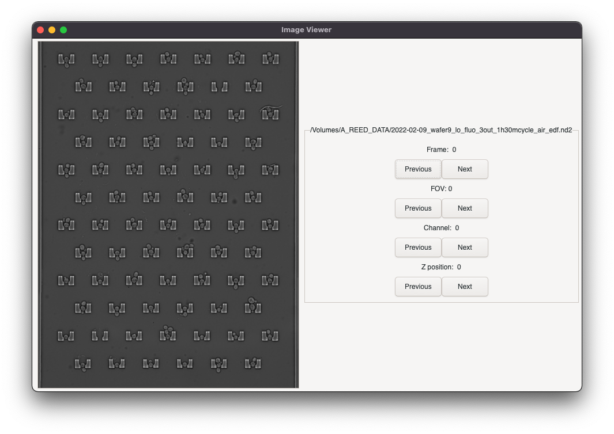
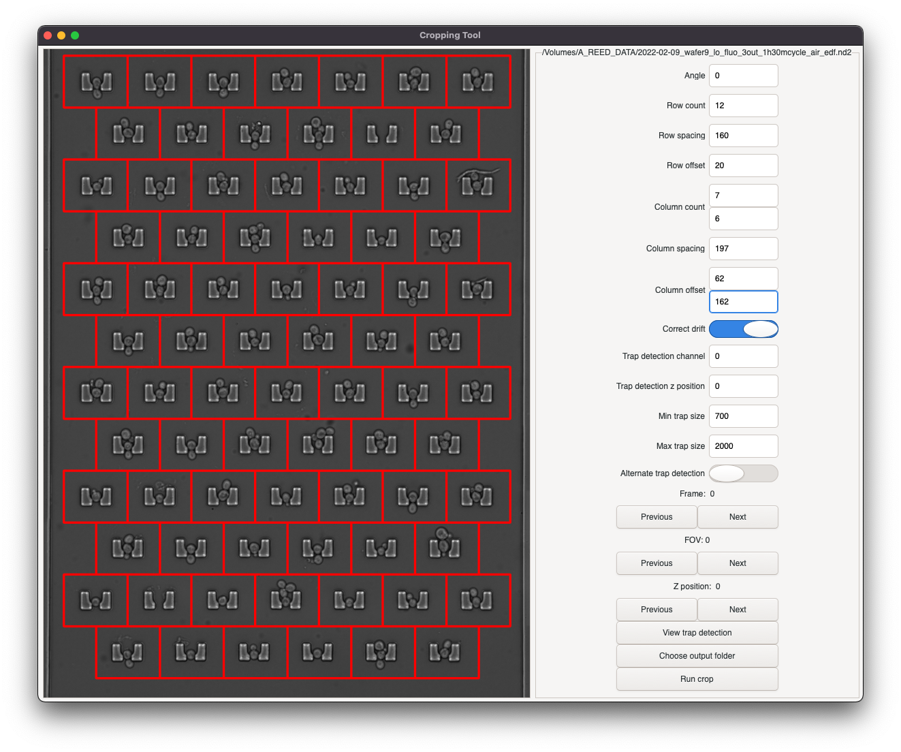
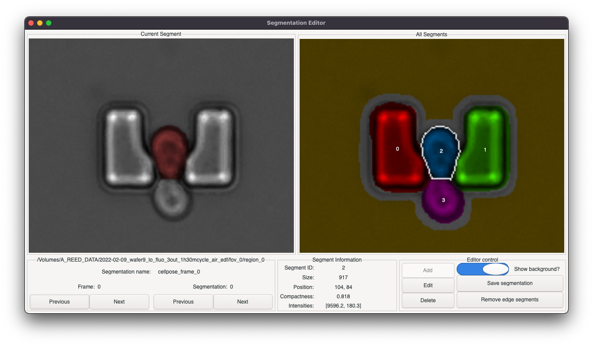
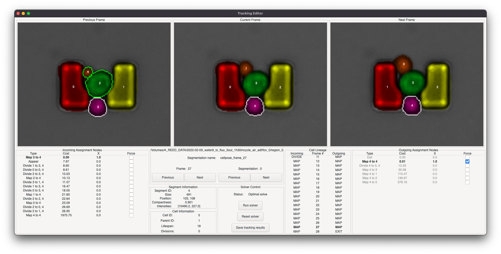

# PhD image analysis tools

This repository contains a public record of the image analysis tools developed over the course of my PhD at the University of Warwick, supervised by Professor John McCarthy. These tools were created for processing time-lapse images of budding yeast cells, confined within microfluidic traps.

## Graphical tools

There are four graphical tools, all written using GTK:

###  Image viewer:  `GUI/ImageViewer.py`

A simple tool for viewing multidimensional ND2 image stacks.

### Cropping tool: `GUI/CroppingTool.py`

This tool is used to divide up images into individual trapping regions, automatically correcting for any stage drift over the course of a time-lapse recording.

### Segmentation curator: `GUI/SegmentationCurator.py`

This tool is for viewing and correcting automatically generated segmentations of individual trapping regions. 

### Tracking editor: `GUI/TrackingEditor.py`

This tool automatically tracks objects between frames in a time-lapse using a factor graph assignment model approach. Corrections to the tracking solution can be applied as additional constraints to the model.

## Scripts

There are a further four script-based tools:

### `Segmentation/CellPoseSegmenter.py`

This script uses [Cellpose](www.cellpose.org) to automatically segment images of each trapping region within a single time-lapse recording.

### `run_segmentation.py`

This script uses a custom histogram thresholding and gap filling approach to automatically segment images of each trapping region from a single time-lapse recording.

### `curate_segmentation.py`

This script manages the curation of a complete time-lapse recording, by running the segmentation editor GUI tool for each trapping region in turn until all have been curated.

### `curate_tracking.py`

This script manages the tracking of a complete time-lapse recording, by running the tracking editor GUI tool for every region with curated segmentation data.

## General workflow

When processing a time-lapse recording, the tools described above were usually used as follows:

 1. Divide up images into individual trapping regions using the cropping GUI tool

 2. Segment all regions automatically using Cellpose segmenter

 3. Curate segmentation of all regions using segmentation editor GUI tool, run via `curate_segmentation.py`

 3. Track all regions using tracking editor GUI tool run via `curate_tracking.py`

 4. Further analysis of completed time-lapse dataset can be undertaken by loading the saved segmentation and tracking JSON data in an appropriate Python script.

